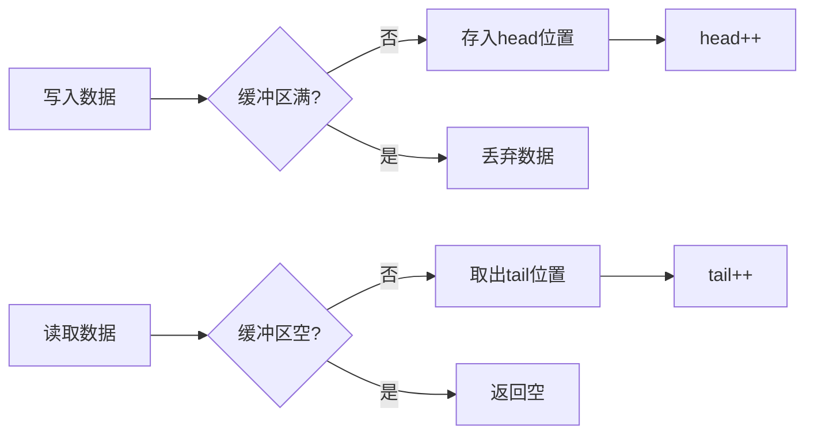
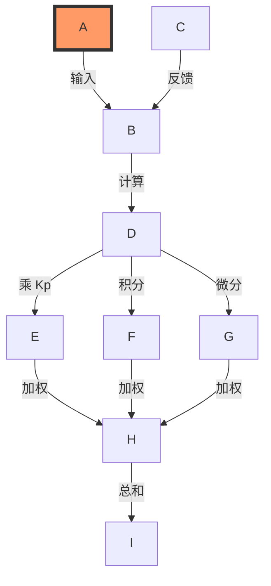
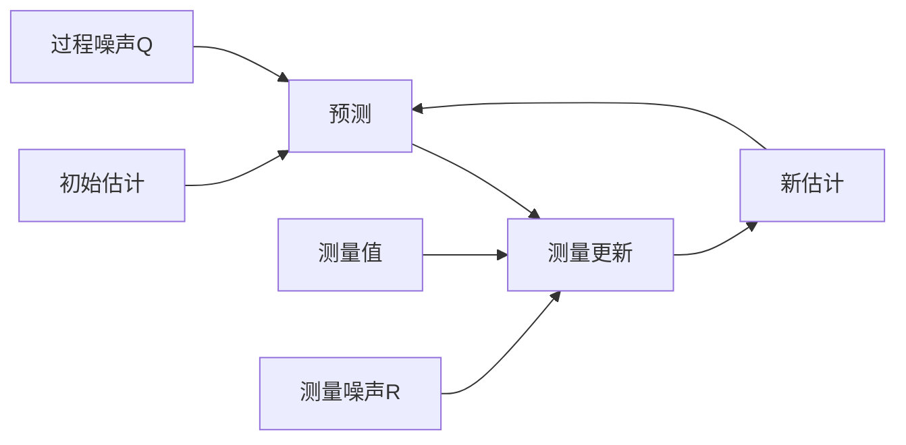

# STM32 算法库技术文档

## 1. 环形缓冲区(Ring Buffer)

### 数学原理
环形缓冲区通过模运算实现循环访问：
- 写入位置：`head = (head + 1) % size`
- 读取位置：`tail = (tail + 1) % size`



## 2. PID控制算法

### 数学原理
#### 位置式PID：
```
u(k) = Kp*e(k) + Ki*∑e(j) + Kd*(e(k)-e(k-1))
```
其中：
- e(k): 当前误差
- ∑e(j): 误差累积
- Kp/Ki/Kd: PID系数

#### 增量式PID：
```
Δu(k) = Kp*(e(k)-e(k-1)) + Ki*e(k) + Kd*(e(k)-2e(k-1)+e(k-2))
```



## 3. 卡尔曼滤波

### 数学原理
预测步骤：
```
x̂ₖ⁻ = A·x̂ₖ₋₁
Pₖ⁻ = A·Pₖ₋₁·Aᵀ + Q
```

更新步骤：
```
Kₖ = Pₖ⁻·Hᵀ/(H·Pₖ⁻·Hᵀ + R)
x̂ₖ = x̂ₖ⁻ + Kₖ·(zₖ - H·x̂ₖ⁻)
Pₖ = (I - Kₖ·H)·Pₖ⁻
```



## 使用条件对比

| 算法 | 适用场景 | 计算复杂度 | 参数调整难度 |
|------|---------|-----------|-------------|
| 环形缓冲区 | 数据流处理 | O(1) | 无需调整 |
| PID控制 | 闭环控制系统 | O(1) | 中等 |
| 卡尔曼滤波 | 状态估计 | O(n³) | 困难 |

## 4. 代码实现详解

### 环形缓冲区核心代码解析
```c
// 初始化缓冲区
void RingBuffer_Init(RingBuffer *rb) {
    rb->head = 0;    // 写指针归零
    rb->tail = 0;    // 读指针归零 
    rb->count = 0;   // 数据计数清零
}

// 数据写入
uint8_t RingBuffer_Put(RingBuffer *rb, uint8_t data) {
    if (rb->count == RING_BUFFER_SIZE) // 检查缓冲区满
        return 0;
    
    rb->buffer[rb->head] = data; // 数据存入head位置
    rb->head = (rb->head + 1) % RING_BUFFER_SIZE; // 循环递增head
    rb->count++; // 数据计数增加
    return 1;
}
```

### PID控制核心代码解析
```c
// 位置式PID计算
float PID_Position_Calc(PID_Controller *pid, float set, float fdb) {
    pid->set = set; // 更新设定值
    pid->fdb = fdb; // 更新反馈值
    float err = pid->set - pid->fdb; // 计算误差
    
    pid->Pout = pid->Kp * err; // 比例项
    
    pid->Iout += pid->Ki * err; // 积分项累加
    pid->Iout = constrain(pid->Iout, -pid->max_iout, pid->max_iout); // 积分限幅
    
    pid->Dout = pid->Kd * (err - pid->last_err); // 微分项
    pid->last_err = err; // 保存本次误差
    
    pid->out = pid->Pout + pid->Iout + pid->Dout; // 输出求和
    pid->out = constrain(pid->out, -pid->max_out, pid->max_out); // 输出限幅
    
    return pid->out;
}
```

### 卡尔曼滤波核心代码解析
```c
float Kalman_Filter(KalmanFilter *kf, float z) {
    // 预测步骤
    kf->x = kf->A * kf->x; // 状态预测
    kf->P = kf->A * kf->P * kf->A + kf->Q; // 协方差预测
    
    // 更新步骤
    kf->K = kf->P * kf->H / (kf->H * kf->P * kf->H + kf->R); // 卡尔曼增益计算
    kf->x = kf->x + kf->K * (z - kf->H * kf->x); // 状态更新
    kf->P = (1 - kf->K * kf->H) * kf->P; // 协方差更新
    
    return kf->x;
}
```

## 5. 参数调优指南

### PID参数整定方法
1. **比例系数Kp**：
   - 先设为0，逐渐增大直到系统出现振荡
   - 取振荡时Kp值的50-60%作为最终值
   - 典型范围：0.1-10.0

2. **积分系数Ki**：
   - 从Kp/10开始调整
   - 消除稳态误差但避免超调过大
   - 典型范围：0.001-1.0

3. **微分系数Kd**：
   - 从Kp/100开始调整  
   - 抑制超调和振荡
   - 典型范围：0.0-1.0

4. **采样周期**：
   - 一般为系统响应时间的1/10~1/5
   - 需要保持固定

### 卡尔曼滤波参数设置
1. **过程噪声Q**：
   - 反映系统模型的不确定性
   - 值越大滤波器对新测量值越敏感
   - 典型范围：0.001-0.1

2. **测量噪声R**：
   - 反映传感器噪声水平  
   - 值越大滤波器对预测值越信任
   - 典型值：传感器误差的方差

3. **初始协方差P**：
   - 反映初始估计的不确定性
   - 通常设为较大值(1-10)

## 6. 使用指南

### 环形缓冲区使用示例
```c
RingBuffer buf;
RingBuffer_Init(&buf);

// 生产者线程
uint8_t data = get_sensor_data();
RingBuffer_Put(&buf, data);

// 消费者线程
uint8_t received;
if(RingBuffer_Get(&buf, &received)) {
    process_data(received);
}
```

### PID控制使用示例
```c
PID_Controller pid;
PID_Init(&pid, PID_POSITION, 1.2, 0.01, 0.05, 100, 50);

while(1) {
    float output = PID_Position_Calc(&pid, target, feedback);
    set_actuator(output);
    HAL_Delay(10); // 固定采样周期
}
```

### 卡尔曼滤波使用示例
```c
KalmanFilter kf;
Kalman_Init(&kf, 0.01, 1, 1, 1, 0, 1);

while(1) {
    float z = read_sensor();
    float filtered = Kalman_Filter(&kf, z);
    printf("Filtered: %.2f\n", filtered);
}
```
